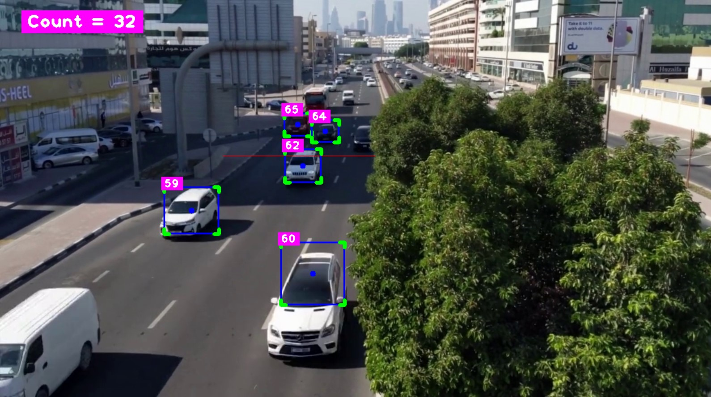

# Car Counting 🚗


This is a Python-based project that uses the YOLOv8 object detection model and the SORT (Simple Online and Realtime Tracking) algorithm to count vehicles in a video feed. 🎥

## Screensort 📸



## Features 🚀

- Real-time vehicle detection and counting 🔍
- Supports various vehicle types (cars, trucks, buses, motorbikes) 🚗🚌🏍️
- Utilizes a custom road mask to focus the detection on the desired region 🛣️
- Tracks individual vehicles across frames using the SORT algorithm 🔍🤖

## Tech used 💻

- Python 3.x
- OpenCV 🖥️
- Ultralytics YOLO 🤖
- SORT (Simple Online and Realtime Tracking) 🔍
- cvzone 🎨

## How it Works 🤖

1. The code loads the YOLOv8 model and initializes the SORT tracker. 🔍
2. It then processes each frame of the video, detecting vehicles using the YOLOv8 model and vehicle types (cars, trucks, buses, bikes). 🚘
3. The detected vehicles are then passed to the SORT tracker, which keeps track of individual vehicles across frames. 🔍
4. The script draws bounding boxes around the detected vehicles, displays the vehicle IDs, and counts the number of unique vehicles that have passed through the linr🔢


## ⚙️ Installation

Follow these steps to run project :

1. **Clone the repository**:
    ```bash
    git clone https://github.com/hetbhalani/Car_Counter.git
    cd Car_Counter
    ```

2. **Install dependencies** :
    ```bash
   pip install requirements.txt
    ```

3. **Run the app**:
    ```bash
    python CarCounter.py 
    ```

## Contributing 🤝

If you find any issues or have suggestions for improvements, feel free to open an issue or submit a pull request. 🙌

## Acknowledgments 🙏

Special thanks to Alex Bewley, the creator of the SORT (Simple Online and Realtime Tracking) algorithm, for his valuable contribution to the field of object tracking.
